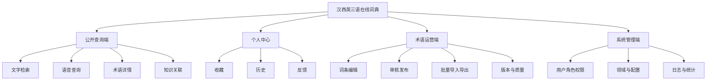
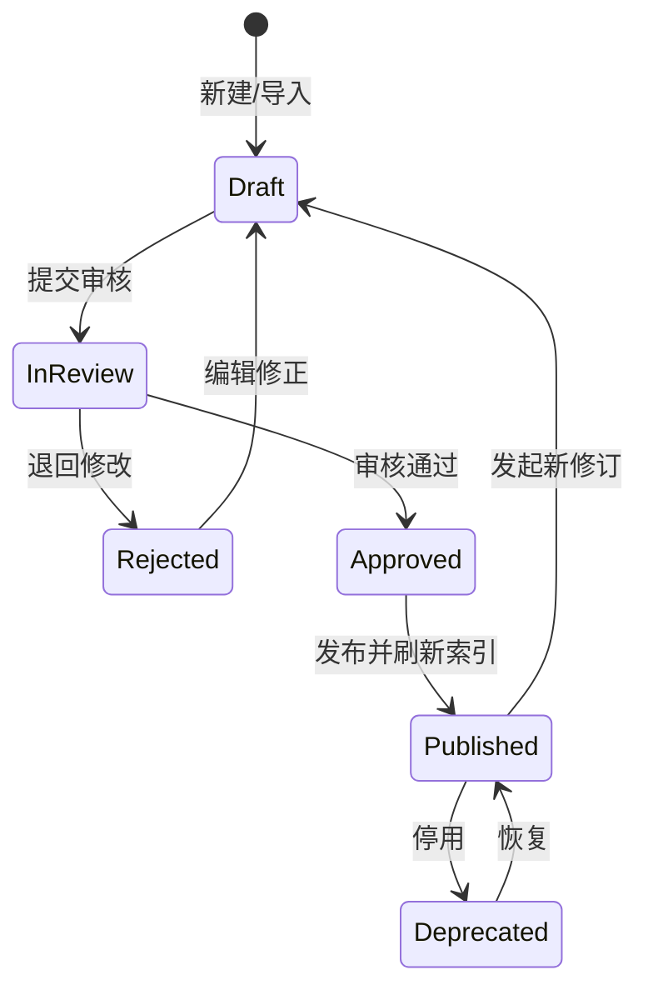
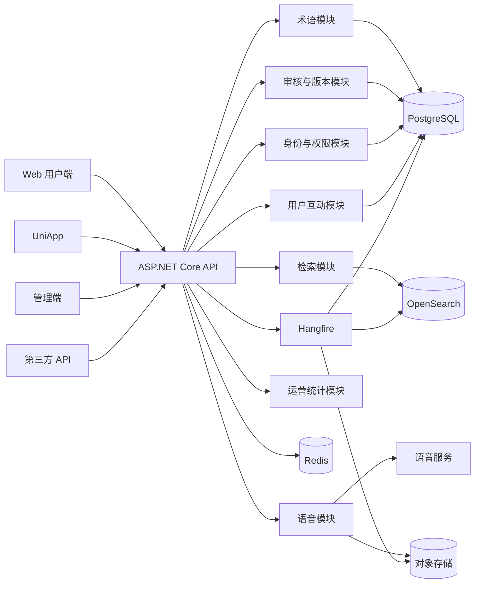
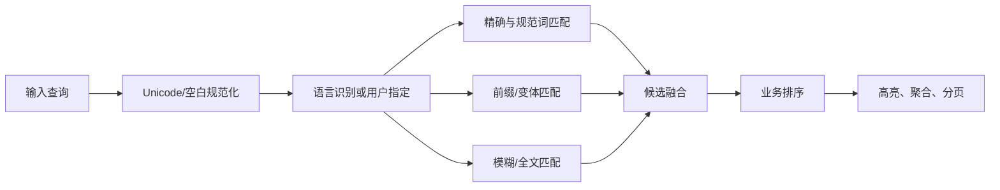

# 汉西英三语在线词典系统项目开发文档

> 文档版本：V1.0  
> 编制日期：2026-09-23  
> 文档状态：研发基线草案  
> 适用阶段：立项、需求评审、架构设计、研发实施与验收

## 1. 文档说明

### 1.1 编制目的

本文档将项目构想转化为可实施的产品与技术方案，用于统一产品、词典学、语言学、研发、测试、运维和数据运营人员的工作口径，并作为后续原型设计、数据库设计、接口设计、任务拆分和项目验收的基线。

### 1.2 项目定位

本项目建设一个面向中文、西班牙语和英语的专业术语在线词典系统。系统以“概念”为核心组织术语，而不是简单维护三种语言之间的成对翻译；通过规范术语库、领域分类、概念关系、来源证据、版本修订和审核流程，为经贸、科研、文化交流等场景提供准确、可追溯、可持续更新的术语服务。

### 1.3 目标用户

| 用户类型 | 主要需求 |
|---|---|
| 普通学习者 | 快速查询、发音、例句、收藏、历史记录 |
| 翻译与外语从业者 | 精准对译、领域筛选、术语辨析、来源追溯 |
| 经贸与科研人员 | 查询专业概念、缩略语、相关术语和知识关系 |
| 术语编辑/语言专家 | 录入、修订、审校、退回和发布术语 |
| 数据管理员 | 批量导入导出、质量检查、版本维护 |
| 系统管理员 | 用户、角色、权限、配置、日志与运行监控 |

### 1.4 首期假设

以下内容在需求进一步确认前作为 V1.0 基线：

1. Web 端支持现代桌面和移动浏览器，移动端以 UniApp 应用/H5 为主。
2. 中文采用简体中文（`zh-Hans`），西班牙语首期以通用西班牙语并标注地区变体，英语采用通用英语并允许标注英式/美式差异。
3. 首期领域建议为经贸、信息技术、科研教育、文化交流四类，数据模型允许无限扩展。
4. 首期不建设重型图数据库；知识关联存放于 PostgreSQL，并同步到搜索索引。关系规模显著增长后再评估 Neo4j 等图数据库。
5. 首期采用模块化单体，保留按模块拆分服务的边界，不在项目早期引入微服务运维成本。

## 2. 建设目标与范围

### 2.1 总体目标

- 建立结构规范、来源可追溯、可持续修订的汉西英三语专业术语数据库。
- 支持精确、前缀、模糊、全文、跨语言和语音查询。
- 展示术语定义、词性、领域、变体、例句、发音、来源和概念关系。
- 建立“提交—审校—发布—修订—回滚”的动态更新机制。
- 同时提供 Web、UniApp 和开放 API，保证多端数据与业务规则一致。
- 建立可量化的数据质量、搜索质量、性能、安全和可用性指标。

### 2.2 V1.0 范围

#### 用户端

- 三语术语搜索与语言自动识别。
- 搜索建议、拼写容错、领域筛选和结果排序。
- 术语详情、三语对译、定义、例句、发音与知识关联。
- 语音输入查询和术语语音播放。
- 登录注册、收藏、查询历史和问题反馈。
- Web 响应式页面和 UniApp 手机端。

#### 术语运营端

- 概念、术语、定义、例句、来源、领域和关系维护。
- 草稿、待审、退回、已发布、已停用等状态管理。
- 双人复核或按角色配置的审核发布流程。
- CSV/XLSX/TBX 数据导入，CSV/XLSX/TBX/JSON 导出。
- 重复项检测、必填校验、语言完整性检查和质量报告。
- 修订历史、差异查看、指定版本回滚和索引重建。

#### 系统管理端

- 用户、角色、权限、字典、参数和领域分类管理。
- 操作审计、登录日志、接口日志和异常告警。
- 搜索热词、无结果词、点击率和数据增长统计。

### 2.3 暂不纳入 V1.0

- 全自动机器翻译结果直接作为正式词条发布。
- 用户之间的即时通信或社区论坛。
- 大规模语料库版权采购与自动抓取。
- 复杂知识图谱推理、自动问答和生成式答案。
- 离线全量词典包；可在后续版本按授权与容量评估。

## 3. 产品功能设计

### 3.1 功能结构



### 3.2 核心用户流程

#### 查询流程

1. 用户输入文本或使用语音录入。
2. 系统识别输入语言，也允许用户手动指定源语言。
3. 系统执行规范化、精确匹配、变体匹配、模糊召回和全文召回。
4. 根据匹配度、领域、权威等级、热度和发布时间排序。
5. 用户进入概念详情，查看三语术语、定义、例句、来源和相关概念。
6. 登录用户可收藏、反馈错误或提交补充建议。

#### 术语发布流程



业务规则：编辑者不能审核自己提交的版本；只有已发布版本对普通用户可见；发布动作必须写入审计日志并触发缓存失效、索引同步和版本记录。

### 3.3 关键页面

| 端 | 页面 | 关键内容 |
|---|---|---|
| Web/UniApp | 首页 | 搜索框、语音入口、热门领域、热词 |
| Web/UniApp | 搜索结果 | 语言/领域/词性筛选、匹配提示、分页 |
| Web/UniApp | 术语详情 | 三语名称、定义、变体、例句、发音、关系、来源 |
| Web/UniApp | 登录注册 | 邮箱/手机号按部署环境配置、验证码、隐私同意 |
| Web/UniApp | 个人中心 | 收藏、历史、反馈、账户设置 |
| 管理端 | 工作台 | 待审数量、数据质量、无结果词、系统概况 |
| 管理端 | 概念编辑 | 多语标签页、来源、关系、附件、质量提示 |
| 管理端 | 审核页面 | 版本差异、审核意见、通过/退回 |
| 管理端 | 数据任务 | 导入校验、错误明细、导出、索引任务 |
| 管理端 | 系统管理 | 用户、角色、权限、配置、日志、统计 |

## 4. 技术选型

### 4.1 推荐技术栈

| 层次 | 选型 | 用途 |
|---|---|---|
| Web 前端 | HTML5、CSS3、TypeScript、Vue 3、Vite | 用户端与管理端单页应用 |
| UI 组件 | Element Plus（管理端）、自建响应式组件（用户端） | 提高后台开发效率并保持用户端品牌一致性 |
| 手机端 | UniApp + Vue 3 + TypeScript | Android、iOS、H5，按需扩展小程序 |
| 后端 | ASP.NET Core 10 + ABP Framework 10.x | API、模块化、DDD 基础设施、权限、审计、本地化 |
| ORM | Entity Framework Core 10 | 领域数据访问与迁移 |
| 主数据库 | PostgreSQL 18 或部署时受支持的稳定版本 | 权威业务数据、事务、JSONB、全文辅助能力 |
| 搜索引擎 | OpenSearch 3.x 或部署时受支持的稳定版本 | 多字段全文、模糊、拼音/分词、聚合与可选向量检索 |
| 缓存 | Redis | 热门词条、配置、分布式缓存、限流计数 |
| 后台任务 | Hangfire（PostgreSQL 存储） | 导入、索引同步、音频生成和统计聚合 |
| 对象存储 | S3 兼容存储（开发环境可用 MinIO） | 发音、附件和导入文件 |
| 语音服务 | `ISpeechService` 适配层；首选 Azure AI Speech | 汉/西/英语音识别与合成，可替换供应商 |
| 鉴权 | OpenIddict / ABP Account + JWT/OIDC | Web、UniApp 和开放 API 统一鉴权 |
| API 文档 | OpenAPI | 接口契约、联调和客户端生成 |
| 可观测性 | OpenTelemetry + Prometheus/Grafana + 结构化日志 | 指标、链路、日志和告警 |
| 部署 | Docker Compose（首期）/ Kubernetes（规模化后） | 环境一致性和弹性扩展 |

### 4.2 后端框架决策：ABP Framework 10.x

ABP Framework 10.x 与 .NET 10 对齐，适合本项目的原因：

- 提供模块化、分层、领域驱动设计和依赖注入约定。
- 内置身份、角色、权限、本地化、设置、审计和后台任务集成能力。
- 适合构建 API 优先的业务系统，Web 与 UniApp 可共享同一接口。
- 可先以模块化单体交付，再按性能或团队边界拆分模块。

约束：仅使用真正需要的 ABP 模块，避免业务代码依赖 UI 模板；所有客户端通过稳定的应用服务/API 契约访问后端。项目创建时固定 .NET、ABP、EF Core 与数据库驱动版本，并在升级前完成兼容性验证。

### 4.3 架构原则

- **概念优先**：翻译是同一概念下不同语言术语的对应关系，不维护脆弱的两两映射。
- **权威库与搜索索引分离**：PostgreSQL 是唯一事实来源，OpenSearch 索引可随时重建。
- **API 优先**：Web、UniApp、管理端和未来第三方均使用版本化 API。
- **模块化单体优先**：保持清晰模块边界，首期单体部署。
- **人工审校优先**：自动化能力提供候选和质量提示，不绕过专家审核。
- **隐私最小化**：只保存必要用户信息；语音原始文件默认短期保留或不保留。
- **可替换外部服务**：语音、邮件、短信、对象存储均通过接口适配。

## 5. 总体架构

### 5.1 逻辑架构



### 5.2 后端模块

| 模块 | 职责 | 主要依赖 |
|---|---|---|
| Identity | 用户、角色、权限、令牌、登录审计 | ABP Identity/OpenIddict |
| Terminology | 概念、术语、定义、例句、来源、领域 | PostgreSQL |
| Knowledge | 上位/下位、同义、反义、相关等概念关系 | Terminology |
| Search | 索引投影、查询解析、排序、建议、热词 | OpenSearch、Redis |
| Workflow | 草稿、审核、发布、修订、回滚 | Terminology、Audit |
| Speech | 语音识别、合成、音频缓存、供应商适配 | 外部语音服务、对象存储 |
| ImportExport | 模板、校验、批处理、错误报告 | Hangfire、对象存储 |
| UserEngagement | 收藏、历史、反馈、贡献建议 | Identity、Terminology |
| Analytics | 搜索事件、无结果词、质量与使用统计 | PostgreSQL、后台任务 |
| Administration | 配置、字典、审计、任务和系统状态 | 各模块 |

### 5.3 建议解决方案结构

```text
src/
  TriDict.Domain.Shared/          # 枚举、常量、共享本地化
  TriDict.Domain/                 # 实体、值对象、领域服务
  TriDict.Application.Contracts/ # DTO、应用服务接口、权限定义
  TriDict.Application/           # 用例编排、验证、映射
  TriDict.EntityFrameworkCore/    # DbContext、映射、迁移
  TriDict.HttpApi/                # API 控制器与版本
  TriDict.HttpApi.Host/           # 应用入口、中间件、DI
  TriDict.DbMigrator/             # 数据库迁移与种子数据
  TriDict.Search/                 # OpenSearch 实现
  TriDict.Speech/                 # 语音服务适配
apps/
  web/                            # Vue 3 用户端
  admin/                          # Vue 3 管理端
  mobile/                         # UniApp
tests/
  TriDict.Domain.Tests/
  TriDict.Application.Tests/
  TriDict.HttpApi.Tests/
  TriDict.IntegrationTests/
deploy/
  docker/
docs/
```

模块间依赖必须指向接口或领域契约，禁止跨模块直接修改数据表。

## 6. 术语学与数据设计

### 6.1 建模原则

系统采用概念导向（concept-oriented）的术语模型：

- 一个 `Concept` 表示一个独立概念。
- 每个概念可拥有多个语言的 `Term`；每种语言可有首选词、允许词和弃用词。
- 定义属于“概念 + 语言”，而非仅属于词形。
- 地区变体、缩略语、别名和拼写变体作为术语属性或关联术语保存。
- 来源、责任人、审核记录和版本不可省略，确保学术可追溯。
- 概念之间使用有类型、有方向的关系表达知识网络。

### 6.2 语言与文本规范

- 语言标签使用 BCP 47，如 `zh-Hans`、`es-ES`、`es-419`、`en-US`、`en-GB`。
- 原文按 Unicode NFC 保存；另建检索规范化字段，不覆盖用户可见原文。
- 西班牙语保留重音符号和 `ñ`；无重音输入可作为容错召回，但准确匹配优先。
- 英语保留大小写敏感的专名原文，检索字段采用大小写折叠。
- 中文保存规范词形，可选存储拼音与声调信息作为辅助字段。
- 所有定义、例句和备注记录语言，不允许依靠界面上下文猜测。

### 6.3 核心实体

| 实体 | 关键字段 | 说明 |
|---|---|---|
| Concept | Id、ConceptCode、Status、DomainId、ReliabilityCode、CurrentVersion | 语言无关的概念主体 |
| Term | Id、ConceptId、LanguageTag、Text、NormalizedText、TermType、PartOfSpeech、Gender、Region、IsPreferred | 某语言中的术语表达 |
| Definition | Id、ConceptId、LanguageTag、Text、DefinitionType、SourceId | 概念定义 |
| Example | Id、ConceptId/TermId、LanguageTag、Text、TranslationGroupId、SourceId | 用例及对齐组 |
| Domain | Id、ParentId、Code、Name、Path、Sort | 多级领域分类 |
| ConceptRelation | SourceConceptId、TargetConceptId、RelationType、IsBidirectional | 概念关系 |
| Source | Id、Title、Author、Publisher、Year、Url、Identifier、License | 词条证据来源 |
| Pronunciation | TermId、Phonetic、Alphabet、AudioObjectKey、Voice、IsHuman | 音标和音频 |
| ConceptRevision | ConceptId、Version、Snapshot、ChangeSummary、SubmittedBy、ReviewedBy、Status | 可审计版本快照 |
| ReviewRecord | RevisionId、Action、Comment、ActorId、OccurredAt | 审核轨迹 |
| UserFavorite | UserId、ConceptId、CreatedAt | 收藏 |
| SearchHistory | UserId/AnonymousId、Query、Language、ClickedConceptId、CreatedAt | 可按隐私策略保留 |
| Feedback | ConceptId、Type、Content、Status、ReporterId、HandlerId | 纠错和建议 |
| ImportJob | File、TemplateVersion、Status、Counts、ErrorReport | 批量导入任务 |

### 6.4 关键枚举

`TermType`：Preferred、Admitted、Deprecated、Abbreviation、Symbol、Variant。  
`RelationType`：Broader、Narrower、Related、Equivalent、Antonym、PartOf、HasPart、Causes、UsedFor。  
`PublicationStatus`：Draft、InReview、Rejected、Approved、Published、Deprecated。  
`ReliabilityCode`：Unverified、CorpusSupported、ExpertReviewed、Authoritative。

### 6.5 数据完整性规则

1. 每个已发布概念至少有一个领域、一个来源和一个首选术语。
2. V1.0 正式发布目标要求中西英三语首选术语齐全；特殊缺失必须填写原因并经高级审核。
3. 同一概念、语言和地区只能有一个首选术语。
4. 同一术语文本可属于不同概念，但搜索结果必须显示领域和义项区分。
5. 关系目标必须存在，不允许概念指向自身；对称关系自动生成反向投影。
6. 上下位和整体部分关系必须执行环路检测。
7. 已发布数据不能原地覆盖，只能创建新修订。
8. 来源 URL 之外应尽量保存书目信息，避免外链失效后无法追溯。

### 6.6 搜索索引文档示例

每个概念在 OpenSearch 中形成一个聚合文档，包含：概念 ID、状态、领域路径、权威等级、发布时间，三种语言的首选词/别名/弃用词、定义摘要、例句摘要、拼音/音标辅助字段和关系摘要。索引不作为业务写入目标，索引失败进入重试队列并可从数据库全量重建。

## 7. 智能检索设计

### 7.1 查询能力

- 精确匹配：首选术语、别名、缩略语和规范化词形。
- 前缀与联想：输入过程中返回建议词、语言和领域。
- 模糊匹配：处理少量拼写错误、漏写重音和单复数变化。
- 全文检索：定义和例句中查找概念。
- 跨语言返回：用任一语言查询，同一概念内返回另外两种语言。
- 领域过滤：支持领域树、词性、语言、地区和权威等级过滤。
- 语义检索（V1.1 可选）：使用多语种向量召回，与词法检索融合排序。

### 7.2 查询处理管线



### 7.3 分语言策略

| 语言 | 处理策略 |
|---|---|
| 中文 | 中文分词；简繁映射只作为可选查询扩展；拼音字段用于辅助召回，不替代原词 |
| 西班牙语 | 小写折叠、词形还原/轻量词干、重音容错、地区变体和性数变化辅助 |
| 英语 | 小写折叠、词形还原/轻量词干、连字符与缩略语规范化 |

### 7.4 排序建议

可解释排序初始权重：首选词精确匹配 100、别名精确匹配 90、前缀匹配 70、模糊匹配 50、定义全文 30；在此基础上叠加领域筛选、权威等级、数据完整度、点击反馈和新鲜度。禁止仅以热度把低质量词条排在权威词条之前。

### 7.5 搜索质量指标

- 标准测试集 Top 1 准确率不低于 85%，Top 5 召回率不低于 95%。
- 常见精确查询 P95 响应时间不高于 500 ms。
- 搜索建议 P95 响应时间不高于 200 ms。
- 无结果率、改写率、点击率和首条点击率可按语言与领域统计。
- 上线前由语言专家建立不少于 500 条的三语黄金查询集，版本迭代时回归。

## 8. 语音功能设计

### 8.1 语音查询

1. 客户端请求麦克风权限，并明确展示录音状态。
2. 客户端录制受支持格式的短音频，建议限制单次时长 15 秒。
3. 服务端校验格式、大小、时长和频率限制。
4. `ISpeechToTextProvider` 调用语音供应商，返回文本、候选语言和置信度。
5. 低置信度时由用户确认或编辑识别文本，再进入标准检索流程。
6. 默认不长期保存原始语音；如为质量改进留存，必须单独征得同意并设置自动删除期限。

### 8.2 发音播放

- 优先级：人工审校录音 > 已审核的合成音频 > 实时语音合成。
- 合成结果按术语、语言、声音、语速和供应商版本生成缓存键。
- 页面明确标识真人或合成语音。
- 专业缩略语、符号和混合语言词需要维护发音覆盖规则。

### 8.3 适配接口

```csharp
public interface ISpeechToTextProvider
{
    Task<SpeechRecognitionResult> RecognizeAsync(
        Stream audio, string? languageHint, CancellationToken cancellationToken);
}

public interface ITextToSpeechProvider
{
    Task<SpeechSynthesisResult> SynthesizeAsync(
        string text, string languageTag, string? voice, CancellationToken cancellationToken);
}
```

供应商密钥只存在服务端密钥管理中，禁止下发到 Web 或 UniApp。

## 9. API 设计

### 9.1 通用约定

- 基础路径：`/api/v1`，重大不兼容变更才升级版本。
- 使用 JSON，字符集 UTF-8，时间统一 ISO 8601 UTC。
- 列表接口使用 `page`、`pageSize`，默认 20，最大 100。
- 错误响应包含 `code`、`message`、`details`、`traceId`；生产环境不返回堆栈。
- 写接口支持幂等键的场景：导入、反馈提交、语音合成任务。
- OpenAPI 是接口契约来源；前端类型从契约生成或自动校验。

### 9.2 公开及用户接口

| 方法 | 路径 | 说明 | 鉴权 |
|---|---|---|---|
| GET | `/search` | 三语综合搜索 | 否 |
| GET | `/search/suggestions` | 搜索建议 | 否 |
| GET | `/concepts/{id}` | 概念详情 | 否 |
| GET | `/concepts/{id}/relations` | 知识关联 | 否 |
| GET | `/domains` | 领域树 | 否 |
| POST | `/speech/recognitions` | 语音转文字 | 可匿名限流/登录 |
| POST | `/speech/syntheses` | 获取或生成发音 | 可匿名限流/登录 |
| GET | `/me/favorites` | 我的收藏 | 是 |
| POST | `/me/favorites/{conceptId}` | 添加收藏 | 是 |
| DELETE | `/me/favorites/{conceptId}` | 取消收藏 | 是 |
| GET | `/me/search-history` | 查询历史 | 是 |
| DELETE | `/me/search-history` | 清空历史 | 是 |
| POST | `/feedback` | 提交纠错/建议 | 是或验证码 |

搜索请求示例：

```http
GET /api/v1/search?q=inteligencia%20artificial&sourceLanguage=es&targetLanguages=zh-Hans,en&domain=it&page=1&pageSize=20
```

### 9.3 管理接口

| 方法 | 路径 | 权限 |
|---|---|---|
| POST | `/admin/concepts` | Terminology.Create |
| PUT | `/admin/concepts/{id}` | Terminology.Update |
| POST | `/admin/concepts/{id}/submit` | Workflow.Submit |
| POST | `/admin/revisions/{id}/approve` | Workflow.Review |
| POST | `/admin/revisions/{id}/reject` | Workflow.Review |
| POST | `/admin/revisions/{id}/publish` | Workflow.Publish |
| POST | `/admin/import-jobs` | Import.Execute |
| GET | `/admin/import-jobs/{id}` | Import.View |
| POST | `/admin/search/reindex` | Search.Reindex |
| GET | `/admin/analytics/no-result-queries` | Analytics.View |

### 9.4 并发与版本控制

实体返回 `rowVersion` 或 ETag。编辑提交时必须携带版本；若后台数据已变化，返回 `409 Conflict` 并提供当前版本摘要，防止术语专家之间相互覆盖。

## 10. 权限与审核

### 10.1 角色

| 角色 | 能力 |
|---|---|
| Visitor | 搜索、查看公开词条、受限语音查询 |
| Member | 收藏、历史、反馈 |
| Contributor | 创建草稿、修改本人草稿、提交审核 |
| Editor | 编辑领域内术语、处理退回项、批量导入草稿 |
| Reviewer | 审核、退回、质量检查，不审核自己的提交 |
| Publisher | 发布、停用、回滚已审核版本 |
| DataAdmin | 领域、来源、导入导出、索引任务 |
| SystemAdmin | 用户、角色、配置、日志；默认不兼任内容审核 |

### 10.2 权限模型

采用“角色权限 + 数据范围”模式。内容权限可限定到领域；高风险权限（发布、回滚、批量导入、索引重建）独立配置并记录审计。生产环境管理员启用多因素认证。

## 11. 非功能需求

### 11.1 性能与容量基线

首期容量假设：10 万概念、30 万术语、日活 1 万、峰值 200 QPS。该假设用于压测，不构成业务上限。

| 指标 | 验收目标 |
|---|---|
| 搜索接口 | P95 ≤ 500 ms，P99 ≤ 1 s |
| 详情接口 | 缓存命中 P95 ≤ 200 ms |
| 搜索建议 | P95 ≤ 200 ms |
| 普通写接口 | P95 ≤ 800 ms（后台异步任务除外） |
| 可用性 | 月度 ≥ 99.9%（计划维护除外） |
| 恢复点目标 RPO | ≤ 15 分钟 |
| 恢复时间目标 RTO | ≤ 2 小时 |

### 11.2 安全

- 全站 HTTPS；浏览器端启用安全响应头和严格 CORS 白名单。
- 密码使用框架安全哈希策略；令牌短期有效并支持刷新与撤销。
- 管理端和公开端权限完全分离，所有写操作服务端鉴权。
- 参数化查询、输出编码、文件类型白名单和反恶意文件扫描。
- 登录、搜索、语音、反馈和导出接口分别限流。
- 敏感配置进入环境变量或密钥管理服务，不写入仓库。
- 日志脱敏，不记录密码、访问令牌、完整语音和不必要的个人信息。
- 审计日志防普通管理员修改，关键日志设置独立保留策略。
- 依赖、容器镜像和源代码定期执行漏洞扫描。

### 11.3 可访问性与国际化

- Web 端以 WCAG 2.2 AA 为目标：键盘可操作、焦点可见、对比度合格、表单有标签。
- 页面 UI 文案与词典内容分离，界面首期支持中文，可扩展西班牙语和英语。
- 使用逻辑方向与自适应布局，不把文本写死在图片中。
- 音频功能提供文本替代，不能成为唯一查询途径。

### 11.4 兼容性

- Web：当前和前一个主要版本的 Chrome、Edge、Safari、Firefox。
- UniApp：Android 10+、iOS 15+ 作为建议基线，最终按用户群确认。
- API 客户端不得依赖未文档化字段；新增字段应向后兼容。

## 12. 数据导入、更新与治理

### 12.1 导入流程

1. 上传文件并生成文件哈希。
2. 校验模板版本、编码、列名、文件大小和恶意内容。
3. 进入暂存区，不直接写入正式概念表。
4. 执行格式、枚举、必填、重复、关系、来源和三语完整性校验。
5. 输出可下载错误报告；用户确认通过记录。
6. 后台任务按批次创建草稿和修订记录。
7. 经审核发布后同步搜索索引。

### 12.2 动态更新机制

- 管理员/专家人工修订：走完整审核发布流程。
- 用户反馈：进入工单池，经编辑确认后转为修订任务。
- 无结果词：按频率、语言和领域形成补词候选。
- 外部数据源：只在许可证允许时接入；保存来源、抓取/导入时间和授权信息。
- 自动候选：机器翻译、语料抽取或大模型只能生成“未验证候选”，不得直接发布。

### 12.3 数据质量评分

建议按完整性 30%、来源权威性 25%、专家审核 25%、跨语言一致性 10%、示例与发音 10% 计算内部质量分。质量分用于运营看板和待办排序，不应替代专业判断。

## 13. 缓存、任务与一致性

- 详情缓存键包含概念 ID 和发布版本；发布后主动失效。
- 热门搜索和领域树可缓存，设置合理 TTL 并支持配置变更主动失效。
- 数据库事务完成后写入 Outbox 事件，由后台任务同步索引，避免“数据库已发布但事件丢失”。
- 索引消费者按概念 ID + 版本幂等处理；旧版本事件不得覆盖新版本。
- 全量重建使用新索引和别名切换，完成校验后原子切换，避免服务中断。
- 导入、导出、音频合成、索引和统计任务均支持进度、重试、取消和错误查看。

## 14. 可观测性与运维

### 14.1 监控指标

- API 请求量、成功率、P50/P95/P99 延迟。
- 搜索延迟、零结果率、OpenSearch 错误率和索引滞后时间。
- PostgreSQL 连接、慢查询、锁等待和存储增长。
- Redis 命中率、内存和淘汰量。
- 后台任务排队量、失败率与重试次数。
- 语音识别成功率、供应商延迟、成本与低置信度比例。
- 登录失败、限流触发、异常导出等安全事件。

### 14.2 日志与链路

所有请求生成 `traceId`，贯通 API、数据库、搜索、后台任务和外部语音调用。日志使用结构化字段，按环境设置保留期；生产环境错误日志与告警平台联动。

### 14.3 备份与恢复

- PostgreSQL 每日全量备份并结合连续归档/增量策略满足 RPO。
- 对象存储启用版本控制或备份策略。
- OpenSearch 不作为唯一数据源，可由 PostgreSQL 重建；大型部署仍建议做快照以缩短恢复时间。
- 每季度执行恢复演练，记录实际 RPO/RTO。

## 15. 测试方案

### 15.1 测试层次

| 类型 | 重点 |
|---|---|
| 单元测试 | 领域规则、规范化、权限判断、质量评分、环路检测 |
| 集成测试 | PostgreSQL、OpenSearch、Redis、Outbox、语音适配器 |
| API 契约测试 | 状态码、分页、错误模型、权限与向后兼容 |
| 端到端测试 | 查询、收藏、编辑、审核、发布、导入全过程 |
| 搜索评测 | 黄金查询集的准确率、召回率、语言与领域分组结果 |
| 性能测试 | 峰值搜索、详情读取、批量导入、索引重建 |
| 安全测试 | 越权、注入、XSS、CSRF、令牌、上传、限流 |
| 可用性测试 | 多语界面、移动端、键盘与读屏基础检查 |
| 恢复测试 | 数据库恢复、索引重建、供应商故障降级 |

### 15.2 发布门禁

- 主分支构建、单元测试和关键集成测试全部通过。
- 数据库迁移可在预发布环境完成，并验证回退方案。
- 不存在未处理的严重/高危安全漏洞。
- 搜索黄金集不低于当前生产基线。
- 核心用户流程端到端测试通过。
- 版本说明、配置变更、迁移步骤和监控项完整。

## 16. 部署环境

### 16.1 环境划分

| 环境 | 用途 | 数据要求 |
|---|---|---|
| Local | 单人开发 | 种子/脱敏样例数据 |
| Dev | 持续集成与联调 | 可重置测试数据 |
| Test | 系统、搜索、性能测试 | 接近生产规模的合成/脱敏数据 |
| Staging | 发布演练与验收 | 生产配置镜像、脱敏数据 |
| Production | 正式服务 | 权限隔离、备份、监控、审计 |

### 16.2 首期部署拓扑

反向代理/CDN → Web 静态资源与 ASP.NET Core API；API 连接 PostgreSQL、Redis、OpenSearch、对象存储和后台任务实例。中小规模可使用 Docker Compose 部署到两台以上主机并使用托管数据库；当高可用、团队或流量需求明确后再迁移 Kubernetes。

### 16.3 CI/CD

1. 拉取请求执行格式检查、构建、测试、依赖和安全扫描。
2. 合并主分支后构建不可变版本镜像并生成 SBOM。
3. 自动部署 Dev/Test，Staging 和 Production 需审批。
4. 数据库迁移由独立迁移程序执行，禁止多个 API 实例抢跑迁移。
5. 发布后运行冒烟测试并观察关键指标，异常时回滚应用版本；数据库采用向后兼容迁移策略。

## 17. 项目实施计划

以下以 4～6 人研发团队为参考，实际排期取决于原始术语数据规模、质量和语音供应商审批周期。

> 第 0 阶段内部基线已于 2026-09-23 完成。交付物见 [第 0 阶段交付物索引](phase-0/00-阶段0交付物索引.md)；正式冻结仍需产品、术语、技术和测试负责人完成联合评审签署。

| 阶段 | 建议周期 | 主要交付物 |
|---|---:|---|
| 0. 需求与词典规范 | 2 周 | 需求基线、术语规范、领域树、原型、黄金查询集初稿 |
| 1. 技术底座 | 2 周 | 代码仓库、ABP 解决方案、鉴权、数据库、CI/CD、环境 |
| 2. 术语核心与管理端 | 4 周 | 概念模型、编辑、审核、版本、来源、导入 |
| 3. 检索与用户端 | 4 周 | OpenSearch、搜索 API、Web 首页/结果/详情、统计事件 |
| 4. UniApp 与语音 | 3 周 | 手机端核心流程、STT/TTS、音频缓存、权限提示 |
| 5. 完善与验收 | 3 周 | 权限、质量看板、性能安全测试、运维文档、试运行 |

建议总周期约 18 周。术语数据清洗与专家审校应从第 0 阶段开始并与研发并行，不应等系统完成后再启动。

### 17.1 里程碑

- M1：需求、术语规范、原型和技术方案通过评审。
- M2：可以登录管理端并创建三语概念草稿。
- M3：完成审核发布，公开端可检索已发布概念。
- M4：Web 和 UniApp 核心流程贯通，语音查询可用。
- M5：达到质量、性能、安全和运维验收标准，进入试运行。

## 18. 验收标准

### 18.1 功能验收

1. 使用中文、西班牙语或英语输入均可返回同概念下的三语术语。
2. 精确、前缀、拼写容错、重音容错、领域筛选和分页可用。
3. 术语详情完整展示定义、词性、领域、变体、例句、来源、发音和关系（存在数据时）。
4. Web 和 UniApp 核心查询结果及权限规则一致。
5. 编辑、审核、发布、退回、停用和回滚流程可追溯。
6. 批量导入不会绕过校验和审核，错误报告可定位到行与字段。
7. 语音识别失败或低置信度时可回退到文本编辑，不阻断查询。
8. 用户收藏、历史和反馈可按隐私设置查看和删除。

### 18.2 数据验收

- 已发布概念符合第 6.5 节完整性规则。
- 抽样词条来源可追溯，修订与审核人可追溯。
- 重复、孤立关系、循环层级和非法语言标签检查通过。
- 导入前后记录数、失败数和差异报告一致。

### 18.3 技术验收

- 达到第 7.5、11.1 节的搜索质量与性能指标。
- 严重和高危安全问题为零。
- 完成备份恢复、索引重建和语音服务故障降级演练。
- OpenAPI、部署、运维、数据模板和用户操作文档齐全。

## 19. 风险与应对

| 风险 | 影响 | 应对措施 |
|---|---|---|
| 原始数据格式与质量不一致 | 延期、搜索质量差 | 先制定词典规范和模板；建立暂存区、质量报告和专家抽检 |
| 三语概念并非一一对应 | 错译、信息丢失 | 概念导向建模；支持地区/语用限制和缺失说明 |
| 专家审核资源不足 | 发布积压 | 领域分工、批次审核、质量优先级、审核 SLA |
| 模糊搜索误召回 | 用户不信任 | 精确匹配优先、显示命中原因、黄金集回归、可调权重 |
| 语音供应商成本或故障 | 功能不可用 | 供应商适配层、缓存、配额、文本回退与熔断 |
| 版权和数据授权不清 | 法律风险 | 来源和许可证必填；导入前完成授权审查；支持下架 |
| 框架/数据库驱动版本不兼容 | 构建或生产故障 | 固定版本、预发布验证、依赖升级窗口、自动化回归 |
| 过早微服务化 | 研发和运维复杂 | 首期模块化单体，基于实测瓶颈再拆分 |

## 20. 后续版本建议

### V1.1

- 多语种向量检索与混合排序。
- 上下文句子辅助消歧。
- 用户贡献与专家认领机制。
- 搜索质量 A/B 测试和词条质量仪表盘。
- TBX/SKOS 更完整的交换与映射能力。

### V2.0

- 语料对齐、术语自动抽取与候选发现。
- 面向机构的 API 密钥、配额、计费和使用报表。
- 可授权的离线词库。
- 图谱可视化和复杂关系查询。
- 在严格引用、权限和审核约束下提供术语问答助手。

## 21. 待确认事项

以下事项不阻塞技术底座设计，但应在原型和数据库最终定版前确认：

1. 首批领域、每个领域的概念数量和现有数据格式。
2. Web 是否需要三语界面，还是仅词典内容三语、界面中文。
3. UniApp 首发目标：H5、Android、iOS或具体小程序平台。
4. 是否允许匿名语音查询与匿名反馈，以及对应验证码/限额。
5. 语音服务部署地区、预算、数据合规要求和首选供应商。
6. 用户注册方式、是否接入高校/机构统一身份认证。
7. 术语审核层级、专家角色、发布 SLA 和责任认定方式。
8. 数据来源、版权许可证、引用格式和下架流程。
9. 生产部署位置、域名、证书、等保或其他合规要求。
10. 预期访问量、可用性等级和开放 API 服务对象。

## 22. 研发启动清单

- [ ] 确认需求范围和第 21 节待确认事项。
- [ ] 形成术语编纂规范、语言风格指南和导入模板。
- [ ] 完成首页、结果页、详情页、编辑页和审核页原型。
- [ ] 确认 .NET 10、ABP 10.x、EF Core 和数据库驱动的固定版本。
- [ ] 建立仓库、分支策略、CI/CD 和环境配置规范。
- [ ] 创建领域模型、数据库迁移和基础种子数据。
- [ ] 建立黄金查询集和首批验收样例词条。
- [ ] 完成语音供应商 PoC、成本测算和隐私评审。
- [ ] 确认备份、监控、告警和安全基线。
- [ ] 将阶段计划拆分为产品、数据、后端、Web、UniApp、测试和运维任务。

## 23. 技术参考

- [.NET 10 概览](https://learn.microsoft.com/dotnet/core/whats-new/dotnet-10/overview)
- [ASP.NET Core 10 概览](https://learn.microsoft.com/aspnet/core/overview?view=aspnetcore-10.0)
- [ABP Framework 文档](https://abp.io/docs/latest)
- [ABP 10.0 迁移说明](https://abp.io/docs/latest/release-info/migration-guides/abp-10-0)
- [Azure AI Speech 语言支持](https://learn.microsoft.com/azure/ai-services/speech-service/language-support)

---

本文档是开发基线，不替代后续的 UI 原型、术语编纂规范、物理数据库设计、OpenAPI 契约、测试用例和部署手册；这些成果应在本基线评审通过后逐项细化并纳入版本管理。
